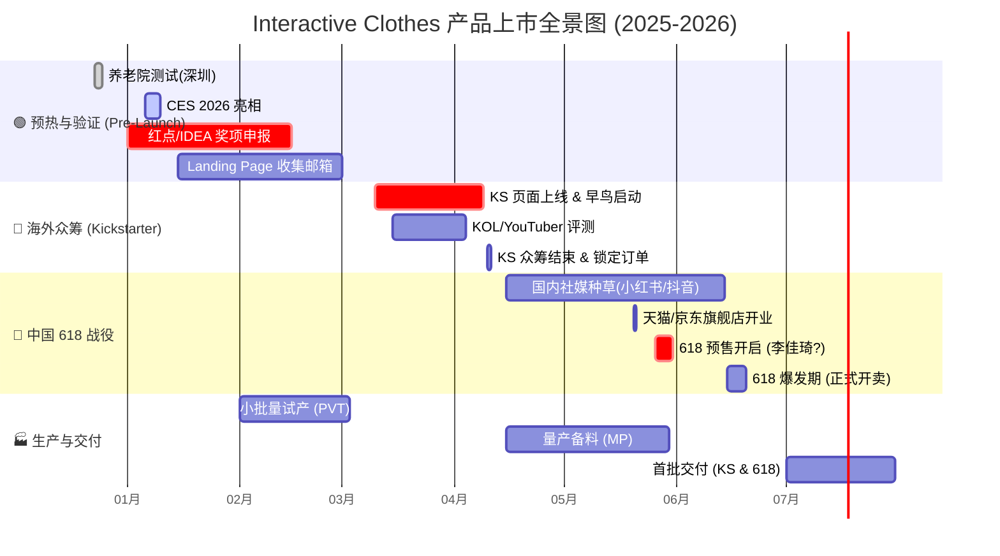

 期间进行国内首发预售（主打礼品市场）。

### 1\. 可视化时间轴 (Mermaid Gantt Chart)

-----

#### **第一阶段：Pre-Launch & 背书积累 (2025.12 - 2026.02)**

  * **目标：** 收集素材，积累信任状，为众筹蓄水。
  * **关键动作：**
      * **12月23-24日：** 完成深圳养老院测试，产出感动人心的“老人笑脸”视频素材（用于 KS 视频开头）。
      * **1月16日前：** 拿下 **Red Dot Product Design** 报名，拿到入围资格（Nominee）也是宣传点。
      * **1月 CES：** 拍摄现场体验者的反应视频（Social Proof），争取获得 TechCrunch 或 Engadget 等媒体报道标题 "The Best Wearable for Seniors at CES"。
      * **2月：** 搭建 Landing Page（着陆页），以“获得早鸟 40% OFF(百分比可以再定)”为诱饵，收集 5000+ 潜在用户邮箱。

#### **第二阶段：Kickstarter 引爆 (2026.03 - 2026.04)**

  * **目标：** 验证市场需求，获取第一笔美金现金流，制造“爆款”新闻。
  * **策略：** **"Tech for Good" (科技向善)**
      * **早鸟价 (Super Early Bird):** 设定限量 500 套，价格极其诱人（如 $199），制造“秒空”假象。
      * **PR 配合：** 此时如果有 Dyson Award 或 Red Dot 的入围消息，立刻在 Update 中发布，刺激观望者下单。

#### **第三阶段：出口转内销 & 618 预售 (2026.05 - 2026.06)**

  * **目标：** 利用海外热度，在中国市场收割“孝心经济”和“极客玩家”。
  * **策略：** **"海外爆红的黑科技，终于回国了"**
      * **5月1日-20日 (种草期):**
          * **小红书：** 投放“送长辈礼物”、“科技助老”话题。博主晒单：“在国外众筹抢疯了的拍拍衣，专门治爸妈肩膀痛”。
          * **知乎/B站：** 硬核拆解，强调 HCI 技术和无订阅良心模式。
      * **5月26日 (预售启动):**
          * 参加天猫/京东 **618 预售 (Pre-sale)**。
          * **话术：** "红点奖设计，CES 明星产品，首批回国限量 2000 件"。
      * **6月15日-18日 (爆发期):**
          * 集中转化。如果产能跟不上，可以卖“现货+期货”（6月发一部分，7月发一部分）。

#### **第四阶段：生产与交付 (2026.07 - 2026.08)**

  * **目标：** 确保口碑，不炸单。
  * **关键点：**
      * **优先发货原则：** 建议优先发 Kickstarter 早期支持者（避免海外差评），紧接着发 618 首批用户。
      * **私域沉淀：** 在包装盒里放“添加康复顾问微信”的卡片，将 618 用户沉淀到私域，进行后续的社群运营和裂变。

-----

### 3\. 不同阶段的营销侧重 (Marketing Angle Shift)

| 阶段 | 平台 | 目标受众 | 核心营销话术 (The Hook) |
| :--- | :--- | :--- | :--- |
| **Pre-Launch** | 官网/EDM | 科技尝鲜者 (Early Adopters) | **"Define the future of somatic wear."**   (定义未来的体感穿戴) |
| **Kickstarter** | Kickstarter | 极客/有老人的欧美家庭 | **"Zero Setup. Zero Subscription. Instant Relief."**   (零门槛，无月费，即刻缓解) |
| **China 618** | 天猫/京东/抖音 | 孝顺子女 (28-40岁) | **"送父母，别只送补品。送一套能'动'的健康。"**   (海外众筹 $50W+ 爆款，红点奖认证) |

### ⚠️ 风险提示 (Risk Management)

1.   618 的发货时间点（6月中下旬）和 Kickstarter 的发货承诺（通常是众筹结束后 3个月，即 7月）非常接近。
      * *对策：* 618 务必设置为\*\*“预售模式” (Pre-order)\*\*，承诺 30-45 天发货，给自己留足缓冲期，不要承诺“次日达”。
2.   假如 Kickstarter 卖 $199 (约 ¥1400)，国内 618 绝对不能卖得比这个贵太多，也不能太便宜导致海外用户退款。
  
