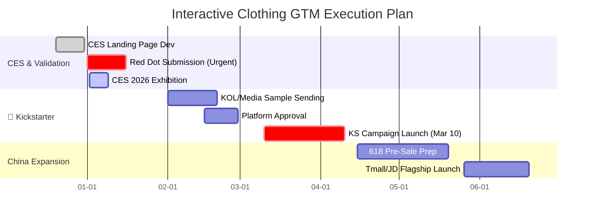
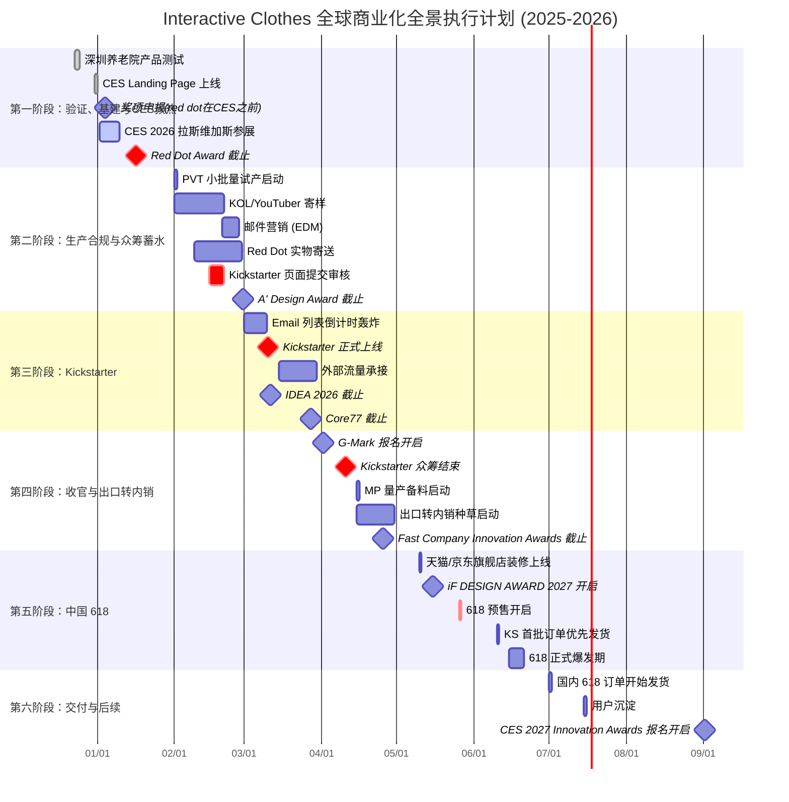

## Visual Timeline

# 🗺️ Interactive Clothes 全球商业化全景执行计划 (2025-2026)

---

## 📅 第一阶段：验证、基建与CES预热 (2025.12 - 2026.01)
**核心目标：** 完成产品验证，利用 CES 和红点奖建立第一波信任背书，收集首批 2000+ 种子邮箱。

### **2025年 12月**
* **12月23-24日** 📢 **深圳养老院产品测试**
    * **行动：** 在深圳养老院进行用户测试。
    * **关键产出：** 拍摄高清的“老人笑脸”与“真实反馈”视频（作为 Kickstarter 视频的核心情感素材）。
* **12月28日** 📢 **CES Landing Page (落地页) 上线**
    * **必须上线：** 在出发去LA前完成。
    * **页面内容：**
        * **Hero Section** 
        * **诱饵:** "Sign up for **20% OFF** Super Early Bird Launch Invite" (点击弹窗输邮箱)。
        * **指引:** CES 展位号 (Venetian Expo, Hall G, Booth #XXXX)。
    * **技术准备：** 确保 Google Analytics 和 Meta Pixel 埋点完成，用于后续追踪。

### **2026年 1月**
* **1月01日** 🏆 **奖项申报准备**
    * **IDEA 2026** (美国工业设计奖) 报名开启。
    * **Core77** (专业组) 报名开启。
* **1月06-09日** 🚀 **CES 2026 拉斯维加斯参展**
    * **现场执行：** 展位设置巨大 QR Code，话术：“Scan to get 20% OFF”；拍摄现场行业专家/体验者的惊讶反应 (Social Proof)。
    * **目标：** 现场收集 **500+** 高质量 B 端/极客邮箱。
* **1月16日** 🏆 **🛑 Red Dot Award: Product Design (Latecomer 截止)**
    * **极度紧急：** 必须在此日期前完成注册并缴纳报名费。
    * **营销价值：** 报名成功后，即便只是 "Submitted" 状态也可以在营销中使用 "Red Dot Award Participant" 增加信任度。
* **1月20日** 🏭 **设计冻结**
    * 根据 CES 反馈微调，输出 PVT (小批量试产) 规格文件。

---

## 📅 第二阶段：生产合规与众筹蓄水 (2026.02)
**核心目标：** 搞定 Kickstarter 审核，扩大邮箱列表至 4000+，媒体评测机发出。

### **2026年 2月**
* **2月01日** 🏭 **PVT 小批量试产启动**
    * **目标：** 生产 **50-100 台** 完美样机 (Golden Sample) 用于媒体评测和红点送样。
* **2月01-20日** 📢 **KOL/YouTuber 寄样**
    * **对象：** 利用 BuzzSumo 等工具筛选 Tech (科技), Wellness (康养), Gadget (极客) 类博主。
    * **要求：** 签订保密协议，约定在 **3月10日** 众筹当天发布开箱视频。   目标是在上线当天有 3-5 个 YouTube 视频同时发布。
3. **邮件营销 (EDM)：**
* 上线前 1 周：公布价格区间，强调“限时早鸟价 (Super Early Bird)”。
* **2月09-27日** 🏆 **Red Dot 实物寄送**
    * **物流：** 将一台功能完美的样机寄往德国 Essen 评审中心。
    * **注意：** 必须提前处理好含锂电池产品的清关手续，确保不被扣关。
* **2月15-20日** 🚀 **Kickstarter 页面提交审核**
    * **关键动作：** 提前 7 个工作日提交。
    * **避坑指南：** 必须上传一段 **无特效实拍功能演示视频** (一镜到底：手拍->发光->APP响应)，证明产品真实可用。
* **2月28日** 🏆 **A' Design Award (Late 截止)**

---

## 📅 第三阶段：Kickstarter 引爆 (2026.03)
**核心目标：** 3月10日首发，必须在 24 小时内完成 **30%-50%** 的众筹目标，这样才能触发 Kickstarter 的算法推荐，获得首页流量 。
* *首日爆发决定成败；需要留 1-1.5 个月预热。*

### **2026年 3月**
* **3月01-09日** 📢 **Email 列表倒计时轰炸**
    * **节奏：** T-3 (3天倒计时), T-1 (明天上线), Launch Now (上线)。
    * **核心信息：** 反复强调 "Super Early Bird 名额有限，手慢无"。
    * **目标：** 确保预启动邮箱列表达到 **4000+** 人。
* **3月10日 (周二)** 🚀 **Kickstarter 正式上线**
    * **黄金时间：** **美东时间 (EST) 上午 8:00 - 10:00**
    * 理由：* 避开周一综合征，利用周二的高用户参与度 。上午 8-10 点是职场人和学生大脑活跃度最高的时段 。
    * 此时如果有 Dyson Award 或 Red Dot 的入围消息，立刻在 Update 中发布，刺激观望者下单。
    * **早鸟价 (Super Early Bird)：** 开启 **48小时限时 Super Early Bird ($199 vs 零售价 $299)**，刺激 CES 积累的用户瞬间转化，设定限量 500 套，价格极其诱人（如 $199），制造“秒空”假象。
    * **客服：** 团队按 EST 时间值班，处理支付问题。
* **3月15日+** 📢 **外部流量承接**
    * **动作：** KOL 评测视频解禁发布；Facebook/Instagram 广告全量投放 (ROAS 目标 > 3.0)。
* **3月11日** 🏆 **IDEA 2026 (常规截止)** 🛑
* **3月27日** 🏆 **Core77 (常规截止)** 🛑

---

## 📅 第四阶段：收官与出口转内销 (2026.04)
**核心目标：** 锁定海外订单，开启国内种草，利用"海外成绩"降维打击。

### **2026年 4月**
* **4月01日** 🏆 **G-Mark (日本优良设计奖) 报名开启**
* **4月10日** 🚀 **Kickstarter 众筹结束**
    * **动作：** 锁定最终订单量，工厂**MP (大规模量产)**。
    * **追加销售：** 使用 PledgeBox 进行配件 (如替换绑带、收纳包) 的 Upsell。
* **4月15日** 🏭 **MP 量产备料启动**
* **4月15日+** 📢 **"出口转内销" 种草启动**
    * **渠道：** 小红书、抖音、知乎、B站。
    * **核心话术：**
        * "海外众筹超 **xx美金**"
        * "红点奖入围产品"
        * "CES 明星产品终于回国"
    * **素材：** 搬运并翻译 KS 上的老外好评截图。
* **4月25日 (预计)** 🏆 **Fast Company Innovation Awards (截止)**

---

## 📅 第五阶段：中国 618 (2026.05 - 2026.06)
**核心目标：** 利用海外势能和父亲节节点，在 618 预售期收割国内订单。

### **2026年 5月**
* **5月10日** 🚀 **天猫/京东旗舰店装修上线**
    * 仅做展示和收藏，暂不可购买。
* **5月15日** 🏆 **iF DESIGN AWARD 2027 (早鸟开启)**
* **5月26日 (晚8点)** 🚀 **618 预售开启 (Pre-sale)**
    * **策略：** 支付定金锁单。
    * **风控关键：** 必须在详情页显著标注 **"预售"**。
    * **目的：** 避开 KS 发货期，防止国内现货早于海外发出，且防止价格穿底（国内价格需略高于 KS 早鸟价）。

### **2026年 6月**
* **6月10日** 🏭 **🚢 KS 首批订单优先发货**
    * **原则：** 必须优先满足海外众筹早期支持者，避免退款和"Scam"指控。
* **6月15-20日** 🚀 **618 正式爆发期**
    * **场景营销：** 配合 **6月21日 父亲节**，主打 "送父母的科技健康礼"、"红点设计认证的孝心"。

---

## 📅 第六阶段：交付与后续 (2026.07 - 2026.09)

### **2026年 7月**
* **7月01日** 🏭 **国内 618 订单开始发货**
    * KS 发货 20 天后，开始国内发货。
* **7月15日** 📢 **用户沉淀**
    * 包装盒内附卡片，引导国内用户添加微信，建立私域社群。

### **2026年 9月**
* **9月 (预计)** 🏆 **CES 2027 Innovation Awards 报名开启**
    * 申请创新奖，为明年的迭代或渠道拓展做准备。

---

## ⚠️ 关键风险与风控措施 (Risk Management)

| 风险点 | 来源依据 | 应对策略 |
| :--- | :--- | :--- |
| **红点奖截止** | 官方Latecomer截止为1月16日 | 务必在 **1月13日** 前完成注册和信用卡支付。 |
| **KS 审核** | KS禁止非首发及无功能样机 | 视频中必须包含**一镜到底**的功能演示。严禁在国内闲鱼/淘宝偷跑销售。 |
| **发货顺序** | KS承诺发货通常在众筹后3个月 | 618 必须做成Pre-order模式。 |
| **价格倒挂** | KS早鸟价通常最低 | 维持价格体系平衡。 |

---

### 3. CES 专属 Landing Page 内容规划

Landing Page 是你产品的小官网，也是 CES 流量的着陆点 。

**页面结构建议：**

| 板块 (Section) | 内容要点 (Content Strategy) | 目的 |
| --- | --- | --- |
 |
| **2. CES Invitation** 

 (展会信息) | **Headline:** "Meet us at CES 2026!" 

 **Location:** **Venetian Expo, Hall G, Booth #5xxxx** (具体展位号) 

 **Map:** 一张简单的展馆地图指引。 

 **Action:** "Book a Demo Slot" (预约演示，收集更多联系人信息)。 | 指引现场观众，增加信任感。 |

 **Text:** "No setup. No pills. Just wear and play." (零门槛，无药，穿上即玩)。 

 强调 **"Non-invasive"** (非侵入式) 和 **"Fun"** (有趣)。 

 |

 |

