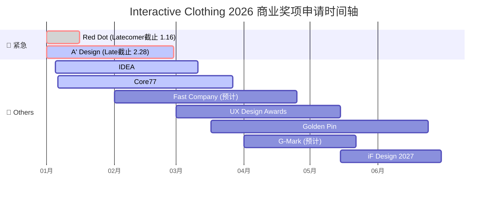

# 2026年度全商业级奖项申请时间轴

### **2026年 1月**

  * **Now - Jan 16 | Red Dot Award: Product Design 2026 (Latecomer 截止)** 🛑 **[极度紧急]**

      * **类型：** 商业产品设计 (全球最高荣誉)
      * **要求：** 产品必须在 2024-2026 年间上市，且必须寄送功能完好的实物。
      * **后续：** 2月9日-27日寄送实物至德国 Essen。
      * 🔗 **官网：** [Red Dot Dates](https://www.red-dot.org/pd/participate)

  * **Jan 05 - Mar 11 | IDEA 2026 (报名开启)**

      * **类型：** 美国工业设计 
      * 🔗 **官网：** [IDEA Schedule](https://www.idsa.org/awards-recognitions/idea/idea-faqs/)

  * **Jan 06 - Mar 27 | Core77 Design Awards 2026 (早鸟报名开启)**

      * **类型：** 交互/工业设计
      * **适合类别：** `Interaction` 或 `Health & Wellness` (Professional 组)
      * 🔗 **官网：** [Core77 Calendar](https://designawards.core77.com/)

        
### **2026年 2月**

  * **Now - Feb 28 | A' Design Award 2026 (Late Submission 截止)** 🛑

      * **类型：** 综合设计 
      * **适合类别：** `Wearable Technologies Design`
      * 🔗 **官网：** [A' Design Dates](https://competition.adesignaward.com/dates.html)

  * **Feb (预计) - Apr 25 (预计) | Fast Company: Innovation by Design Awards (早鸟开启)**

      * **类型：** 商业创新/媒体奖 
      * **特点：** 极高的媒体曝光率，对融资和市场营销帮助大。                                                                                                                                                                                                                                                                                                                                                                                                                                                                                                                                                                                                                                                                                                                                                                                                    
      * 🔗 **官网：** [Fast Company](https://www.fastcompany.com/apply/innovation-by-design)

    

### **2026年 3月**

  * **Mar 01 - May 15 | UX Design Awards (Autumn 报名开启)**

      * **类型：** 交互体验专项 (德国)
      * **适合组别：** `Product` (商业产品)
      * 🔗 **官网：** [UX Design Dates](https://ux-design-awards.com/enter/dates)

  * **Mar 11 | IDEA 2026 (Late Submission 截止)** 🛑

  * **Mar 17 - Jun 24 | Golden Pin Design Award (金点设计奖)**

      * **类型：** 华人市场权威奖项 (台湾)
      * 🔗 **官网：** [Golden Pin](https://www.goldenpin.org.tw/)

  * **Mar 27 | Core77 Design Awards 2026 (截止)** 🛑

### **2026年 4月**

  * **Apr 01 - May 22 (预计) | Good Design Award (G-Mark) 2026**

      * **类型：** 亚洲商业设计标杆 (日本)
      * **适合理由：** 日本市场对适老化科技接受度高。
      * 🔗 **官网：** [G-Mark Schedule](https://www.g-mark.org/zh-CN/apply/gda/schedule)

  * **Apr 25 (预计) | Fast Company: Innovation by Design Awards (截止)** 🛑

### **2026年 5月**

  * **Mid May | iF DESIGN AWARD 2027** 

      * **类型：** 德国商业设计奖
      * 🔗 **官网：** [iF Dates](https://ifdesign.com/en/if-design-award-and-jury)

  * **May 15 | UX Design Awards (截止)** 🛑

  * **May 22 (预计) | Good Design Award (G-Mark) (截止)** 🛑

### **2026年 6月**

  * **Jun 24 | Golden Pin Design Award (截止)** 🛑

### **2026年 9月**

  * **Sep (预计) | CES 2027 Innovation Awards** 
      * **类型：** 消费电子/科技 (美国)
      * 🔗 **官网：** [CES Awards](https://www.ces.tech/ces-innovation-awards/innovation-awards/)

### **2026年 11月**

  * **Nov 05 (预计) | iF DESIGN AWARD 2027 (Late Submission 截止)** 🛑

-----

## 按**报名紧迫性**排序

| 奖项名称 | 核心赛道 | 报名窗口 (Start) | 截止日期 (DDL) | 
| :--- | :--- | :--- | :--- |
| **Red Dot (Product)** | **工业设计** | **Now** | **Jan 16** | 
| **IDEA** | **工业设计** | Jan 05 | Mar 11 |  
| **A' Design** | **综合设计** | Now | Feb 28 | 
| **Core77 (Pro)** | **交互/HCI** | Jan 06 | Mar 27 | |
| **Fast Company** | **商业/媒体** | Feb (预计) | Apr 25 (预计) | 
| **UX Design Awards**| **交互** | Mar 01 | May 15 |  
| **G-Mark** | **亚洲** | Apr 01 (预计)| May 22 (预计)|  
| **Golden Pin** | **华人市场** | Mar 17 | Jun 24 | 
| **iF DESIGN 2027** | **工业设计** | Mid May | Nov 05 (预计)| 
| **CES 2027** | **科技消费** | Sep (预计) | TBD | 

