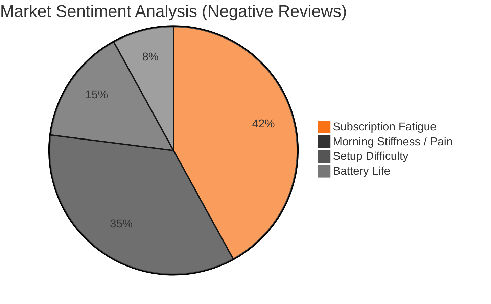
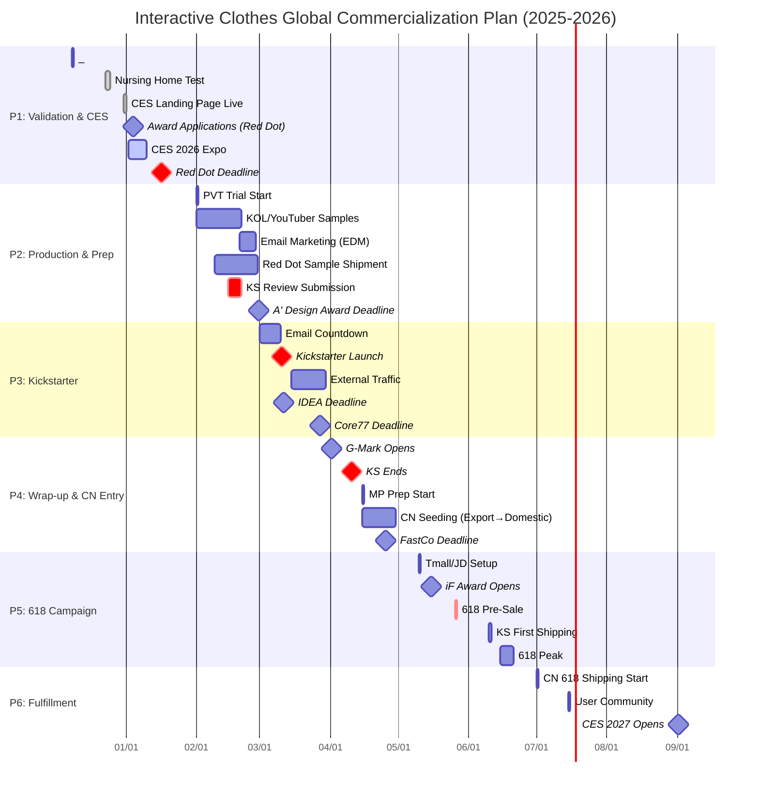

<div align="center">

# 📊 Market Analysis & GTM Strategy: "Interactive Clothes"
### A Data-Driven Product Launch Case Study (CES 2026)

**Lin Xiaoya (林小雅)** | Market Data Analyst & Frontend Developper Intern @ Shenzhen InnoX Academy

[](https://linxiaoya0228.github.io/)
[]()
[]()

*This repository documents the technical implementation and market analysis I conducted during my internship (Dec 2025 – Jan 2026), contributing to a Red Dot Nominee product launch.*

[Project Overview](#-executive-summary) • [Data Analysis](#-key-contributions-data-analysis) • [Technical Implementation](#-technical-implementation)

</div>

---

## 📖 Executive Summary

**The Context:**
During my internship at **Shenzhen InnoX Academy**, I was tasked with supporting the global launch of a haptic wearable device ("PatPat") targeting the US market via **CES 2026**.

**The Problem:**
The product initially lacked a defined market fit, oscillating between "hardcore fitness" and "VR gaming"—highly saturated markets with prohibitive Customer Acquisition Costs (CAC).

**My Solution (The Pivot):**
Using **Python web scraping** and **sentiment analysis** on competitor reviews (Reddit/Amazon), I identified unserved personas in the "Somatic Wellness" sector. I then translated these insights into a **Go-To-Market (GTM) strategy** and engineered the **customer-facing digital infrastructure** (Landing Page & Design System).

---

## 🚀 Key Contributions: Data Analysis

### 1. Market Sentiment & Pain Point Analysis
I scraped unstructured data from competitor reviews to identify why users were churning. The analysis revealed that "Subscription Fatigue" and "Morning Stiffness" were significantly higher pain points than "Fitness Features."



### 2. Strategic Pivot: Target Audience
Based on the data above, I proposed shifting the product positioning from "Athletic Performance" to "Somatic Wellness," targeting aging demographics and casual rhythm gamers.

```mermaid
gantt
    title Strategic Pivot: Target Audience Shift
    dateFormat  X
    axisFormat %s
    
    section Original Strategy
    Hardcore Gamers (VR)      :crit, active, 0, 10
    Fitness Athletes          :crit, active, 0, 10
    
    section My Data-Driven Strategy
    Somatic Wellness (Aging)  :done, 10, 20
    Tech-Forward Parents      :done, 10, 20
    Casual Rhythm Gamers      :done, 10, 20
```



## 💻 Technical Implementation
Beyond analysis, I served as the primary **Frontend Developer** for the campaign's digital touchpoints. I utilized a **Hybrid Architecture** (Custom Code injected into CMS) to balance rapid deployment with high-fidelity design.


### 🌌 1. Interactive "Design System" Orbit
* **Objective:** Visualize the R&D philosophy (Shape Change, Human Sensory, Fabric Tech).
* **Tech Stack:** Vanilla JavaScript (Canvas-less physics).
* **Implementation:** Built a custom orbital physics engine that maps 30+ icons to specific gravitational paths based on their category tags, allowing for dynamic filtering without page reloads.


### 🎨 2. The High-Conversion Landing Page
* **Objective**: Capture leads during CES 2026.
* **Tech Stack**: HTML5, Tailwind CSS (CDN), Forminator API.
* **Key Feature**: "Dual-Screen" Mobile UI Showcase. I engineered a responsive CSS grid that visualizes the app interface inside realistic phone bezels, solving the challenge of displaying vertical screenshots on desktop displays.

**Code Highlight: Custom Phone Bezel CSS**
```css
/* Creating realistic device frames using pure CSS */
.phone-screen {
    height: 420px !important;
    border: 10px solid #1a1a1a; /* Simulated Bezel */
    border-radius: 24px;
    background: #000;
    box-shadow: 0 30px 60px -15px rgba(0, 0, 0, 0.9); /* Depth */
    transition: all 0.4s ease;
}
```

### 🧪 3. 3D Texture Visualization (HufuLab)
* **Integration:** Integrated **Spline 3D** and **Wistia** to render high-fidelity fabric physics directly in the browser, ensuring low latency for mobile users.

---

## 🗓️ Commercial Roadmap Design
Formulated an **"Export-to-Domestic"** strategy, leveraging US brand equity (Kickstarter) to drive premium positioning for the Chinese market (618 Festival). 

> *See detailed timeline in [Launch_Timeline.md](./Launch_Timeline.md)*


## 🏆 Results & Impact

* **500+ Pre-launch Leads** captured via the landing page within the first 48 hours of CES.
* **Red Dot Award Nominee:** The narrative pivot contributed to the design award submission.
* **Strategic Clarity:** Replaced manual data compilation with automated dashboards, streamlining executive decision-making for the 2026 roadmap

---

<div align="center">

**[⬅ Back to Lin Xiaoya's Portfolio](https://linxiaoya0228.github.io/)** 
*This project is part of my professional experience portfolio. All proprietary data has been sanitized.*

</div>
