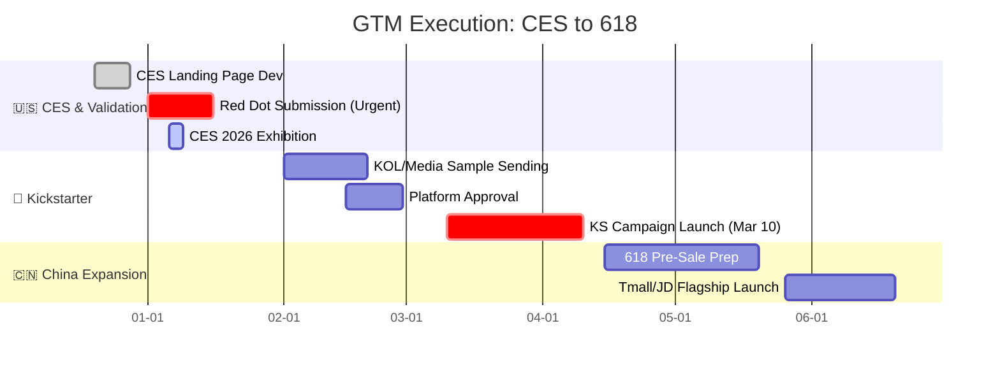

# 🚀 GTM Strategy & Digital Execution: "Interactive Clothes"
### From Sentiment Analysis to Frontend Implementation

*A comprehensive market analysis, commercial roadmap, and landing page implementation for a haptic wearable startup.*

---

## 📖 Executive Summary
**The Challenge:** A hardware startup developed a "haptic vest" with 12 vibration nodes but lacked a clear market fit and a conversion-optimized digital presence.

**My Role:** As a Market Data Analyst & Frontend Contributor, I pivoted the product strategy based on user sentiment analysis and **engineered the official landing page** to capture leads for CES 2026.

---

## 💻 Digital Execution: High-Conversion Landing Page
> *I designed and coded the responsive frontend to ensure a seamless user experience from "Interest" to "Lead Capture."*

### 🎥 Interaction Demo
*(Placeholder: Upload your GIF showing the page scroll, responsive mobile view, and the custom Forminator survey interaction)*

**Key Engineering Contributions:**
* **Custom CSS Architecture:** Overrode strict WordPress plugin defaults using advanced CSS selectors to force a **2-column Grid Layout** for surveys, improving readability on desktop while maintaining a single-column flow for mobile.
* **Responsive Design:** Utilized `Media Queries` and `Tailwind CSS` to ensure pixel-perfect rendering of complex visuals (e.g., the 12-point haptic feedback map) across all device sizes.
* **Lead Capture Optimization:** Replaced standard forms with a gamified, multi-step questionnaire to capture buyer intent (Price sensitivity & Feature preference) without sacrificing UX.

---

## 📊 Market Analysis: The Pivot
> *See full analysis in [Market_Analysis_and_Personas.md](./Market_Analysis_and_Personas.md)*

By analyzing "frequency keywords" in negative reviews of competitors, I discovered that **"Morning Stiffness"** and **"Subscription Fatigue"** were the two biggest pain points.

| Competitor Weakness | Our Strategic Pivot |
| :--- | :--- |
| **"Hardware as a Service"** (Monthly Fees) | **"One Price, Lifetime Access"** (No Subscription) |
| **"Athletic/Aggressive"** Branding | **"Gentle/Somatic"** Branding for Aging Parents |
| **"Setup Friction"** (Tripods/Mounts) | **"Wear & Play"** (Zero Setup Friction) |

---

## 🗓️ Commercial Roadmap
> *See detailed timeline in [Launch_Timeline.md](./Launch_Timeline.md)*

I designed a "Export-to-Domestic" strategy: Building brand equity in the US (CES + Kickstarter) to drive premium sales in China.

---

## 🛠️ Tools & Technologies
* **Web Development**: HTML5, CSS3 (Grid/Flexbox), Tailwind CSS, WordPress
* **Data Analysis**: Python (Scrapy), Tableau, Excel
* **Strategy**: SWOT Analysis, Persona Modeling
